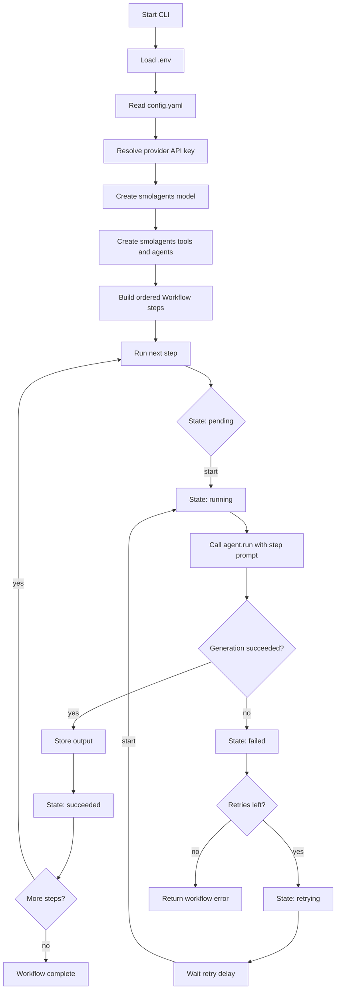

## anchora

anchora is a small Python workflow engine for running AI agent steps in order.

The current example uses the
[`smolagents`](https://huggingface.co/docs/smolagents/en/index) framework:

- a research agent that answers a prompt about Go's `select` statement
- a summarization agent that can use a local `summarize` tool

Each workflow step has an ID, an agent, and a prompt. The workflow runs steps
sequentially, logs each output, and uses a simple state machine to track whether
a step is pending, running, succeeded, failed, or retrying.

## How it works

1. `anchora.cli` loads `.env`, reads `config.yaml`, and resolves the provider
   API key from the configured provider name.
2. It creates a smolagents model using the configured provider, model, token,
   and token limit.
3. It creates `smolagents.ToolCallingAgent` instances and optional tools.
4. It builds a `Workflow` with ordered `Step` values.
5. `Workflow.run` executes each step.
6. Each step calls `agent.run`. On success, the response is stored and logged.
   On failure, the state machine moves the step into retry states until retries
   are exhausted.

## Workflow diagram



## Configuration

`config.yaml` controls the model provider and retry behavior:

```yaml
provider:
  name: huggingface
  model: Qwen/Qwen3-Next-80B-A3B-Thinking
  inference_provider: auto
  max_tokens: 1024
  # api_key_env: HF_TOKEN
  # base_url:

workflow:
  max_retries: 2
  retry_delay_ms: 500
```

For `provider.name: huggingface`, anchora uses smolagents'
`InferenceClientModel` and authenticates with `HF_TOKEN`. Set
`provider.inference_provider` to `auto`, `hf-inference`, or another Hugging Face
Inference Provider supported by your chosen model. Set `provider.base_url` only
when targeting a dedicated Inference Endpoint.

If `provider.model` does not include a LiteLLM provider prefix, anchora prefixes
it with `provider.name` for non-Hugging Face providers.

Known provider environment defaults:

- `groq` -> `GROQ_API_KEY`
- `huggingface` -> `HF_TOKEN`
- `openai` -> `OPENAI_API_KEY`

For a custom provider, set `provider.api_key_env`.

## Install

```sh
uv sync
```

Or install with pip:

```sh
python -m venv .venv
. .venv/bin/activate
pip install -e .
```

## Run

Set `HF_TOKEN` in your environment or in a local `.env` file:

```sh
HF_TOKEN=your_huggingface_token_here
```

Run the workflow:

```sh
uv run anchora
```

The program prints state transitions and step outputs to the logs.

## Test

```sh
uv run --extra dev pytest
```
