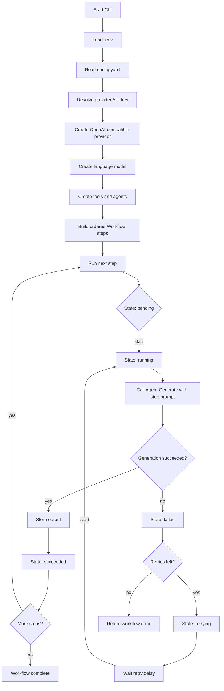

## anchora

anchora is a small Go workflow engine for running AI agent steps in order.

The current example wires up two agents with the
[`charm.land/fantasy`](https://charm.land/fantasy) library:

- a research agent that answers a prompt about Go's `select` statement
- a summarization agent that can use a `summarize` tool

Each workflow step has an ID, an agent, and a prompt. The workflow runs the
steps sequentially, logs each output, and uses a simple state machine to track
whether a step is pending, running, succeeded, failed, or retrying.

## How it works

1. `main.go` loads `.env`, reads `config.yaml`, and resolves the provider API
   key from the configured provider name.
2. It creates an OpenAI-compatible model provider using the configured base
   URL, model, and token limit.
3. It creates agents and optional tools.
4. It builds a `Workflow` with ordered `Step` values.
5. `Workflow.Run` executes each step.
6. Each step calls `Agent.Generate`. On success, the response is stored and
   logged. On failure, the state machine moves the step into retry states until
   retries are exhausted.

## Workflow diagram



## Configuration

`config.yaml` controls the model provider and retry behavior:

```yaml
provider:
  name: groq
  base_url: https://api.groq.com/openai/v1
  model: llama-3.3-70b-versatile
  max_tokens: 1024

workflow:
  max_retries: 2
  retry_delay_ms: 500
```

For the default config, set `GROQ_API_KEY` in your environment or in a local
`.env` file:

```sh
GROQ_API_KEY=your_api_key_here
```

## Run

```sh
go run .
```

The program prints state transitions and step outputs to the logs.
