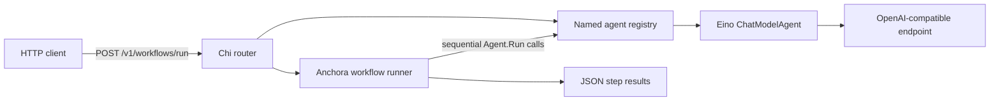
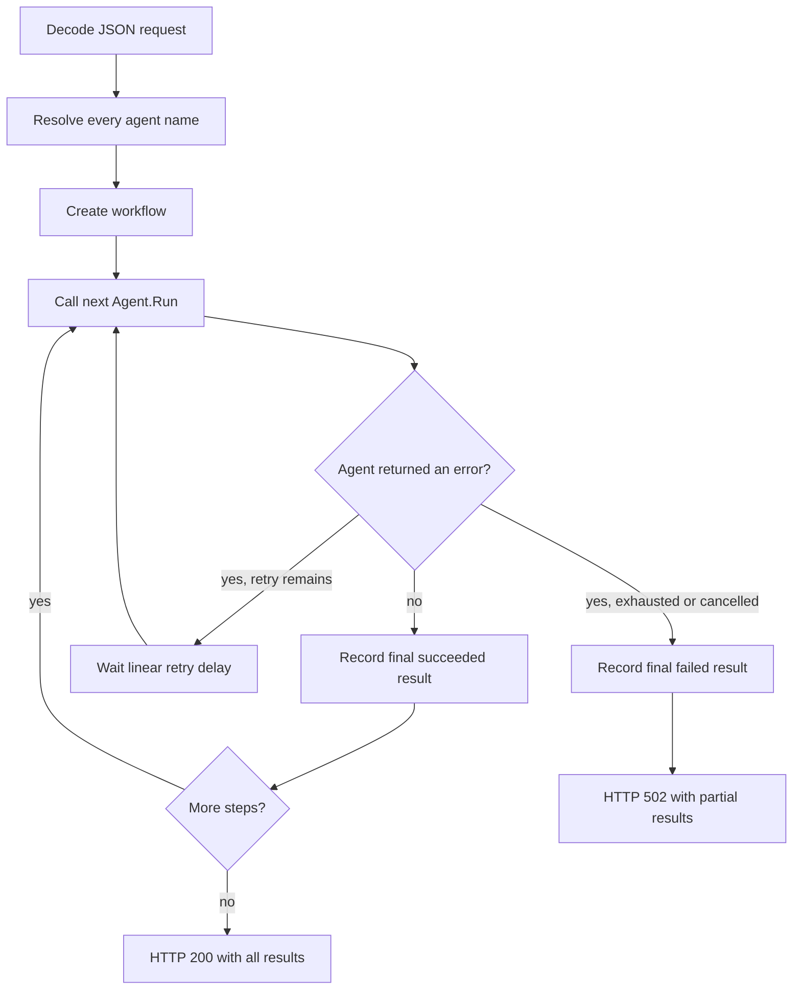

# anchora

Anchora is a Go HTTP service and library for running a list of named AI-agent prompts sequentially. It combines a small workflow runner, a [Chi](https://github.com/go-chi/chi) HTTP boundary, and Eino ADK agents backed by OpenAI-compatible chat-completion endpoints.

It is an early, in-process service: workflows are synchronous, execution state is returned only in the response, and no workflow, result, or retry state is persisted.

## What is implemented

- Ordered, fail-fast step execution.
- Linear retry delays (`retry_number × retry_delay_ms`) after agent failures.
- Request-context propagation to every agent invocation and retry wait.
- Named Eino `ChatModelAgent` instances, created once when the server starts.
- A JSON HTTP API with a health endpoint, body-size limit, strict unknown-field rejection, and panic recovery.
- A Go library interface for applications that want to register their own agents instead of using the bundled Eino configuration.

Not implemented: asynchronous jobs, persistence, queues, authentication, authorization, streaming responses, live status polling, tool configuration, and agent-to-agent delegation.

## Architecture


```mermaid
flowchart LR
    Client[HTTP client] -->|POST /v1/workflows/run| Router[Chi router]
    Router --> Registry[Named agent registry]
    Registry --> Eino[Eino ChatModelAgent]
    Eino --> Model[OpenAI-compatible endpoint]
    Router --> Workflow[Anchora workflow runner]
    Workflow -->|sequential Agent.Run calls| Registry
    Workflow --> Result[JSON step results]
```

The packages have distinct responsibilities:

- `anchora` contains the workflow runner and the `Agent` interface. It has no model-provider dependency.
- `einoagent` adapts an Eino ADK `ChatModelAgent` to `anchora.Agent`. The current implementation uses Eino’s OpenAI model component, so configured agents require an OpenAI-compatible endpoint.
- `httpapi` implements the Chi routes, JSON decoding, request validation, and HTTP response mapping.
- `config` decodes and validates YAML configuration.
- `cmd/anchora` creates the configured Eino agents, registers them by name, and starts the HTTP server.

### Request lifecycle


```mermaid
flowchart TD
    A[Decode JSON request] --> B[Resolve every agent name]
    B --> C[Create workflow]
    C --> D[Call next Agent.Run]
    D --> E{Agent returned an error?}
    E -->|no| F[Record final succeeded result]
    F --> G{More steps?}
    G -->|yes| D
    G -->|no| H[HTTP 200 with all results]
    E -->|yes, retry remains| I[Wait linear retry delay]
    I --> D
    E -->|yes, exhausted or cancelled| J[Record final failed result]
    J --> K[HTTP 502 with partial results]
```

Steps are evaluated in request order. The first failed step stops the workflow, so later steps are not returned or run. `attempts` in a result is the number of retries performed, not the total number of calls. A result exposes only its final state (`succeeded` or `failed`); the internal `pending`, `running`, and `retrying` states are not streamed or persisted.

## Prerequisites

- Go 1.24 or later, as declared in `go.mod`.
- An OpenAI-compatible chat-completion endpoint and API key for every configured agent.

The repository’s checked-in [config.yaml](/Users/sagnikc/Desktop/Projects/anchora/config.yaml) intentionally contains an empty agent registry. The server starts with that file and responds to `/healthz`, but every workflow request will return `400 unknown agent` until at least one agent is configured.

## Configure and run

Copy or edit `config.yaml` to add agents. `model` is the only required agent field. When `api_key_env` is omitted, `OPENAI_API_KEY` is used.

```yaml
server:
  address: ":8080" # Defaults to :8080 when omitted or empty.

workflow:
  max_retries: 2      # Defaults to 0 when omitted.
  retry_delay_ms: 500 # Defaults to 0 when omitted.

agents:
  research:
    model: gpt-4o-mini
    api_key_env: OPENAI_API_KEY
    # base_url: https://your-openai-compatible-endpoint/v1
    instruction: You are a concise research assistant.
    max_tokens: 1024
    max_iterations: 3
    timeout_ms: 30000
```

Set the configured API-key environment variable, then run the server:

```sh
export OPENAI_API_KEY=replace-me
go run ./cmd/anchora -config config.yaml
```

Configuration behavior:

| Field | Behavior |
| --- | --- |
| `server.address` | Listen address; empty becomes `:8080`. |
| `workflow.max_retries` | Non-negative number of retries after the initial call; omitted is `0`. |
| `workflow.retry_delay_ms` | Non-negative base delay in milliseconds; omitted is `0`. |
| `agents.<name>.model` | Required model ID. |
| `api_key_env` | Environment variable holding the API key; defaults to `OPENAI_API_KEY`. |
| `base_url` | Optional OpenAI-compatible endpoint base URL. |
| `instruction` | Optional Eino agent system instruction. |
| `max_tokens` | Optional completion-token limit; `0` leaves the model default unchanged. |
| `max_iterations` | Optional Eino agent generation-cycle limit; `0` uses Eino’s default. |
| `timeout_ms` | Optional total model HTTP timeout; `0` leaves Eino without a configured timeout. |

The process exits during startup if a configured agent lacks a model or its API-key environment variable is empty.

## HTTP API

### `GET /healthz`

Returns HTTP 200:

```json
{"status":"ok"}
```

This endpoint only confirms that the process is serving HTTP; it does not verify model credentials or reachability.

### `POST /v1/workflows/run`

The request body is JSON, limited to 1 MiB. Unknown JSON fields are rejected. Every step requires non-empty `id`, `agent`, and `prompt`; IDs must be unique and `agent` must match a configured or registered agent.

```json
{
  "steps": [
    {"id":"research", "agent":"research", "prompt":"Explain Go select."},
    {"id":"summary", "agent":"research", "prompt":"Summarize it in one sentence."}
  ]
}
```

```sh
curl -X POST http://localhost:8080/v1/workflows/run \
  -H 'Content-Type: application/json' \
  -d '{"steps":[{"id":"research","agent":"research","prompt":"Explain Go select."}]}'
```

On success, the service returns HTTP 200:

```json
{
  "steps": [
    {"id":"research", "status":"succeeded", "attempts":0, "output":"..."}
  ]
}
```

| Condition | Status | Body |
| --- | --- | --- |
| Invalid JSON, invalid step data, empty step list, duplicate IDs, or unknown agent | 400 | `{"error":"..."}` |
| All steps succeed | 200 | `{"steps":[...]}` |
| An agent fails after retries or the request context is cancelled | 502 | `{"steps":[...]}` containing completed steps and the failed step |
| Recovered panic in a handler | 500 | Chi’s recovery response |

Agent-failure responses do not include a top-level error message. Inspect the final failed step’s `error` field.

## Embed the workflow library

The HTTP server is optional. Any implementation of `anchora.Agent` can be used directly with a workflow:

```go
type ResearchAgent struct{}

func (ResearchAgent) Run(ctx context.Context, prompt string) (string, error) {
    return callYourExistingService(ctx, prompt)
}

workflow, err := anchora.NewWorkflow([]anchora.Step{
    {ID: "research", Agent: ResearchAgent{}, Prompt: "Explain Go select."},
}, anchora.Options{MaxRetries: 2, RetryDelay: 500 * time.Millisecond})
if err != nil {
    // Handle invalid workflow definition.
}
results, err := workflow.Run(context.Background())
```

To expose application-provided agents over HTTP, create an `httpapi.AgentRegistry` and pass it to `httpapi.NewRouter`.

## Test

```sh
go test ./...
```
